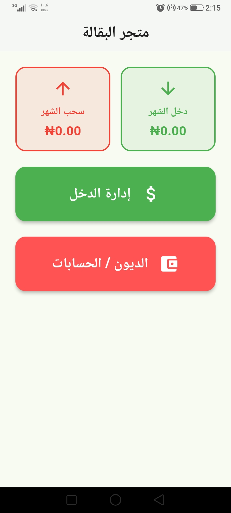
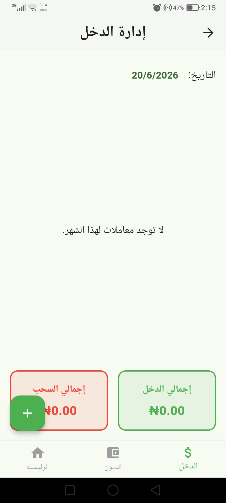
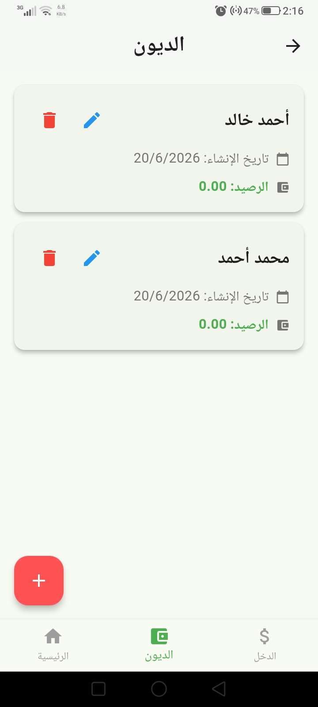

# Shope Management

A comprehensive Flutter application for managing small shop operations, including income and expense tracking, customer account management, user management, and business performance monitoring through an interactive dashboard.

## Features

### 💰 Income Management

- Record and manage income transactions
- Track daily, weekly, and monthly revenue
- Categorize income sources
- View transaction history
- Automatic balance calculations

### 💸 Expense Management

- Record and manage expense transactions
- Categorize expenses
- Monitor business spending
- View expense history
- Track profit and loss

### 👥 Customer Management

- Add, edit, and delete customer accounts
- Store customer information and contact details
- Track customer transactions
- Manage customer balances
- View customer account history

### 👤 User Management

- Create and manage user accounts
- Store user information securely
- Manage business records
- Track user activities

### 📊 Dashboard Statistics

- Overview of total income and expenses
- Current balance monitoring
- Profit and loss calculations
- Financial summaries
- Business performance insights

### 🎨 User Interface

- Clean and intuitive design
- Responsive Flutter UI
- Material Design components
- Easy navigation between sections
- Mobile-friendly experience

## Screenshots

<p align="center">
  
  
  
  
</p>

## Installation

### Prerequisites

- Flutter SDK
- Dart SDK
- Android Studio or VS Code

### Setup

1. Clone the repository:

```bash
git clone <repository-url>
cd shope-management
```

2. Install dependencies:

```bash
flutter pub get
```

3. Run the application:

```bash
flutter run
```

## Project Structure

```text
lib/
├── main.dart          # Application entry point
├── generated/         # Generated files
├── l10n/             # Localization resources
└── pages/            # Application screens and pages
```

## Core Modules

### Dashboard

Provides an overview of:

- Total income
- Total expenses
- Current balance
- Business statistics

### Income

- Add income records
- Edit transactions
- Delete transactions
- View income history

### Expenses

- Add expense records
- Edit expenses
- Delete expenses
- View expense history

### Customers

- Manage customer information
- Track customer balances
- Store transaction records
- Maintain customer accounts

### Users

- Manage user accounts
- Store user information
- Monitor account activities

## Architecture

The application follows a structured Flutter architecture:

- **Pages**: User interface screens
- **Generated**: Auto-generated resources
- **L10n**: Localization support
- **Main**: Application initialization and configuration

## Data Management

- Stores customer information
- Maintains income and expense records
- Saves user account data
- Preserves application data between sessions

## Localization

The application supports multiple languages through Flutter's localization system.

## Building for Production

### Android

```bash
flutter build apk --release
```

### iOS

```bash
flutter build ios --release
```

### Web

```bash
flutter build web --release
```

### Windows

```bash
flutter build windows --release
```

## Version 1.0.0

- Initial release
- Income management system
- Expense tracking functionality
- Customer account management
- User management system
- Dashboard analytics
- Localization support
- Responsive Flutter UI
